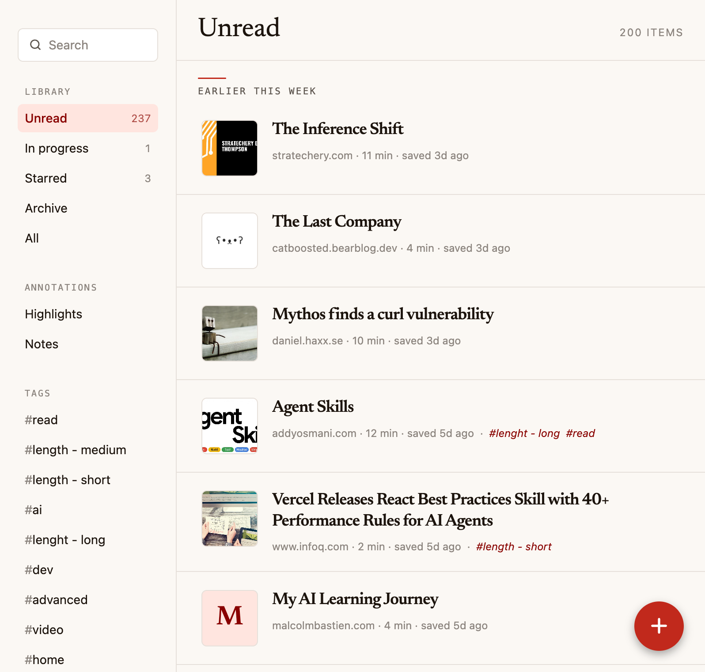
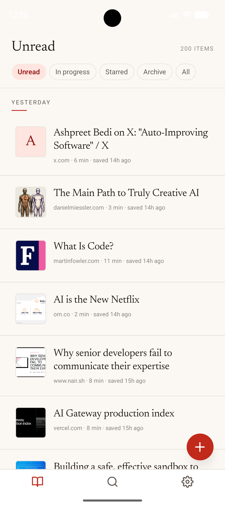
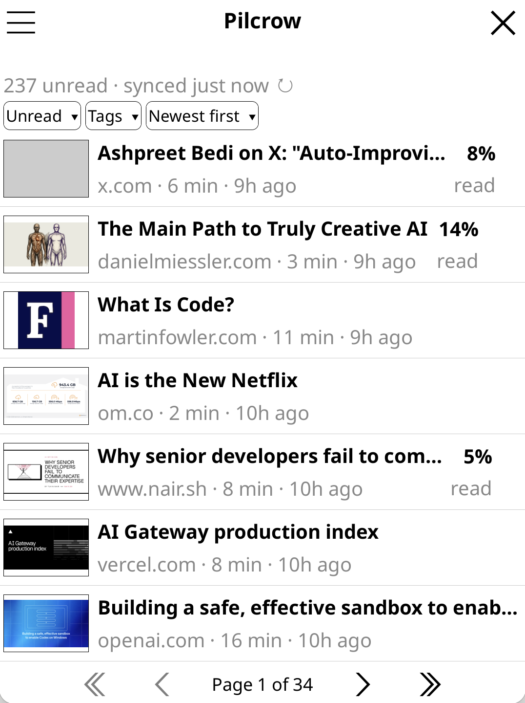

# Pilcrow

A clean, fast reading app for [**Wallabag**](https://wallabag.org) and
[**Readeck**](https://readeck.org) — the two main open-source read-it-later
services. Save articles from the web, then read them on your phone, your
laptop, or your Kobo eink reader.

Pilcrow is an independent client. You connect it to your own Wallabag or
Readeck server.

> **Heads up — this is a personal project.** I built Pilcrow because I
> couldn't find a reading client for Readeck / Wallabag, or a KOReader
> integration, that fit how I read. Plenty of other clients exist; this
> one happens to match my taste. It was also entirely vibe-coded — I
> didn't engineer it from a spec, I built whatever made the next read
> feel nicer. Things are rough in places, the test coverage is patchy,
> and corners I don't personally hit may well be broken. It works for my
> use case; your mileage will vary. PRs and issues welcome, but this
> isn't a polished product.

## Screenshots

<table>
  <tr>
    <td width="50%" colspan="2"></td>
  </tr>
  <tr>
    <td align="center" colspan="2"><em>Web — library, filters, tags, annotations</em></td>
  </tr>
  <tr>
    <td width="50%"></td>
    <td width="50%"></td>
  </tr>
  <tr>
    <td align="center"><em>iOS / Android</em></td>
    <td align="center"><em>KOReader plugin on Kobo</em></td>
  </tr>
</table>

## What you get

- **One library, three places to read it.** iOS, Android, and a web app
  (open in any browser, install as a PWA).
- **Reader-first.** Newsreader serif type, justified text, light/dark/sepia
  themes, adjustable size, scroll resume.
- **Search, filters, tags.** Full-text search across everything you've
  saved. Quick filters for unread, starred, archived, and in-progress.
- **Annotations.** Highlight passages, attach notes, sync them back to your
  server.
- **Save from anywhere.** Paste a URL in-app, or drag the Pilcrow
  bookmarklet to your browser's bookmarks bar.
- **Offline-friendly.** Articles, images, and your tag list cache locally;
  changes you make offline are queued and replayed when you reconnect.
- **Kobo support.** A separate [KOReader plugin](koreader-plugin/pilcrow.koplugin/)
  brings the same library to eink devices.

## Getting started

### 1. Have a Wallabag or Readeck server

Pilcrow needs a server to talk to. Either is fine:

- **Wallabag** — see <https://wallabag.org>. Use the hosted plan at
  <https://app.wallabag.it> or self-host.
- **Readeck** — see <https://readeck.org>. Self-hosted; the docs walk you
  through Docker, a single binary, or building from source.

### 2. Open Pilcrow

- **Web:** self-host the included Docker image. The repo ships a
  `Dockerfile` and a `compose.yaml`; the
  [deploy guide](docs/DEPLOY.md) walks through the same-origin proxy
  setup (no CORS configuration needed on your backend) plus the
  cross-origin alternative. Open the URL in any browser and install
  as a PWA from the address bar.
- **iOS / Android:** native builds will be published once the release
  pipeline is wired up. In the meantime, follow the developer
  [README](DEVELOPMENT.md#develop-locally) to run a local build.

### 3. Sign in

On first launch Pilcrow asks for:

1. Your server URL (`https://app.wallabag.it`, `https://readeck.example.com`, …).
2. Your credentials — Wallabag uses an OAuth client id/secret + username/password;
   Readeck uses a device-code flow you confirm in your browser.

After sign-in, Pilcrow syncs your library in the background. The first sync
on a large library can take a minute or two; subsequent syncs are
incremental and near-instant.

### 4. Read

Tap an article from the library to open the reader. Long-press text to
highlight it; tap a highlight to add a note. The action bar at the bottom
of the reader gives you star, archive, share, prefs, and delete.

To save a new article, tap **+** in the bottom bar (phone) or floating
button (tablet/desktop), or use the bookmarklet you'll find under
**Settings → Save shortcuts**.

## Kobo / eink reading

If you have a Kobo, the
[KOReader plugin](koreader-plugin/pilcrow.koplugin/) gives you the same
queue on eink. The reason this plugin exists at all: every Wallabag /
Readeck integration I could find for KOReader stops at "fetch the article,
let me read it." That's a download mechanism, not a client. Pilcrow's
plugin is a full client — filters, tags, search, sort, in-progress
detection, star / archive / delete, and **two-way highlight + note sync**
with your server. Highlights you make on the Kobo show up on the web app
and in your Readeck/Wallabag account; highlights from elsewhere pull down
into a Highlights list on the device.

It's a separate piece of software (different license, runs inside
KOReader) but talks to the same backend. See its
[README](koreader-plugin/pilcrow.koplugin/README.md) for install
instructions and the full feature list.

## Privacy & security

Pilcrow is a client. Your articles, tags, and credentials live on **your**
server — Pilcrow only stores what it needs to log in and what it has
downloaded for offline reading.

A few things worth knowing:

- On iOS and Android, your tokens are stored in the system Keychain /
  Keystore. On the web, they're stored in `localStorage` — only as secure
  as the browser origin you load Pilcrow from. Don't host Pilcrow on a
  domain you share with untrusted JavaScript.
- Article HTML is rendered in a sandboxed frame, isolated from the rest of
  the app. Scripts inside an article cannot see your tokens or other
  articles, but they do run inside that frame.

Found a security issue? Please see [SECURITY.md](SECURITY.md).

## Development & contributing

See [DEVELOPMENT.md](DEVELOPMENT.md) for build instructions, project
layout, and notes on adding backends.

## License

The Expo app and surrounding tooling are [MIT](LICENSE)-licensed.

The KOReader plugin under
[`koreader-plugin/pilcrow.koplugin/`](koreader-plugin/pilcrow.koplugin/) is
licensed separately under
[**AGPL-3.0-or-later**](koreader-plugin/pilcrow.koplugin/LICENSE) to match
the KOReader runtime it links against. The two directories can be used
independently.

The bundled Newsreader font is licensed under the SIL OFL 1.1 (see
[`assets/fonts/OFL.txt`](assets/fonts/OFL.txt)).

## Trademarks

Pilcrow is an independent client and is not affiliated with the Wallabag
or Readeck projects. _Wallabag_ and _Readeck_ are trademarks of their
respective owners.
